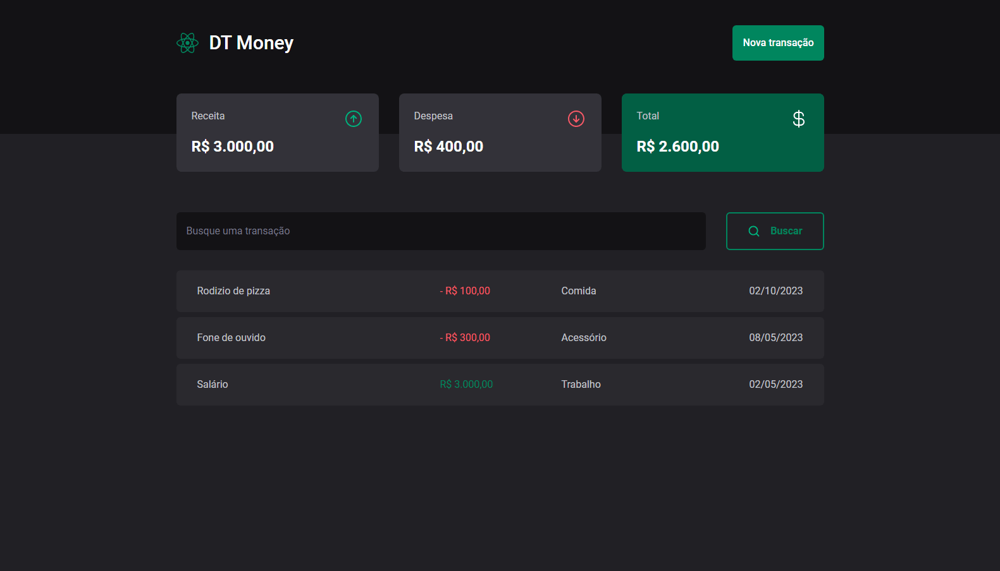
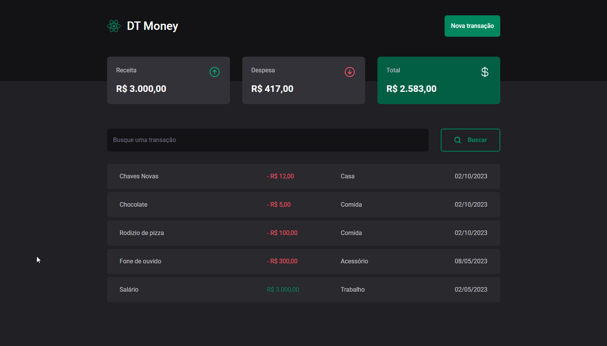

<h1 align="center">Bem-vindo ao DT Money! 👋</h1>
<p>
  
  <a href="https://github.com/Patolinow/estudos/blob/master/LICENSE" target="_blank">
    
  </a>
</p>

>  DT Money é a melhor forma pra você simplificar seu controle financeiro!

### ✨ [Demo](https://dt-money-b8fe9.web.app)

## Features

### Adicione novos items à lista!


### Exclua ou pesquise items existentes


## Como modificar o projeto

Primeiro é necessário realizar a instalação dos pacotes através do comando
```sh
npm install
```

Após isso, utilize o comando a seguir para visualizar as modificações do código em tempo real:
```sh
npm run dev
```

## Autor

👤 **Fábio Neves**

* Website: https://patofolio.web.app
* Github: [@patolinow](https://github.com/patolinow)
* LinkedIn: [@fabio--neves](https://linkedin.com/in/fabio--neves)

## 📝 License

Copyright © 2023 [Fábio Neves](https://github.com/patolinow).<br />
This project is [MIT](https://github.com/Patolinow/estudos/blob/master/LICENSE) licensed.

***
_This README was generated with ❤️ by [readme-md-generator](https://github.com/kefranabg/readme-md-generator)_